## Logging IoT High Frequency Data Off Chain 

Authors: [David Burela](https://www.linkedin.com/in/davidburela/) and [Whitney Griffith](https://www.linkedin.com/in/whitneygriffith/) 

### Overview 

The following workflow was created to address scalibility, privacy and compliance concerns when leveraging a blockchain. This scenario was specifically designed to manage the influx of real-time, high frequency IoT data in such a way that the data written to the blockchain is reduced (scalability increased) and the immutability of the raw data is guaranteed and can be readily verified.

Using the following technologies:
- [Azure Blob Storage, Immutable Blobs](https://docs.microsoft.com/en-us/azure/storage/blobs/storage-blob-immutable-storage) 
- [Azure Blockchain As A Service](https://azure.microsoft.com/en-us/services/blockchain-service/)
- [Azure Functions](https://azure.microsoft.com/en-us/services/functions/)
- [Azure Eventhubs](https://azure.microsoft.com/en-us/services/event-hubs/) 
- [Azure Logic Apps](https://azure.microsoft.com/en-us/services/logic-apps/) 

Millions of off chain events can be collected, stored in immutable blob storage, and the hash of each blob can then be anchored on the blockchain for verification of immutability.

__Arcthitecture__

N.B. Event Hubs write the data to immutable blob on a set interval such as every second or every minute. 
 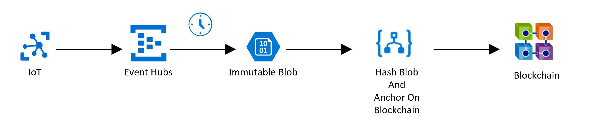

__Logic App Connectors__ 

  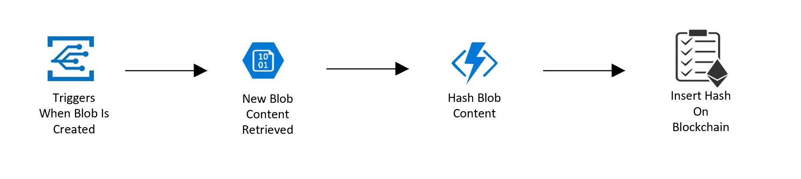


### Prerequisites: 
- [Azure Blockchain Member Deployed](https://docs.microsoft.com/en-us/azure/blockchain/service/create-member)
- [HashLog Smart Contract deployed to network](./blockchain/contracts/hashLog.sol)

### Walkthrough 

#### Create Immutable Blob Container in Azure Blob Storage

Navigate to [Azure Portal](http://portal.azure.com/)

**Create a new Storage account**
- Click the + symbol in the upper left corner of the screen to add a new resource
- Search for and select Storage and then click Create
- Fill in the following:
    - Resource group
    - Storage account name 
    - Location
    - Review + create

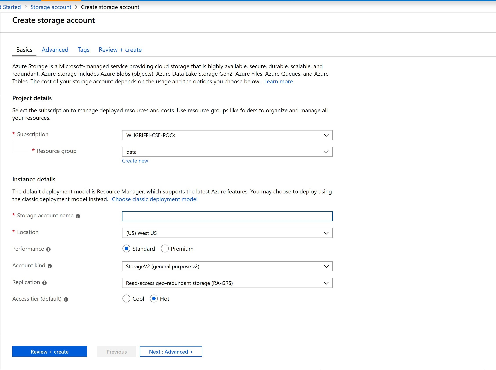

**Create immutable blob container**
    
Navigate to the recently created storage account dashboard. 
- Under Blob storage, select Blobs. 
- Select +Container. Set the name of the new container and select OK.

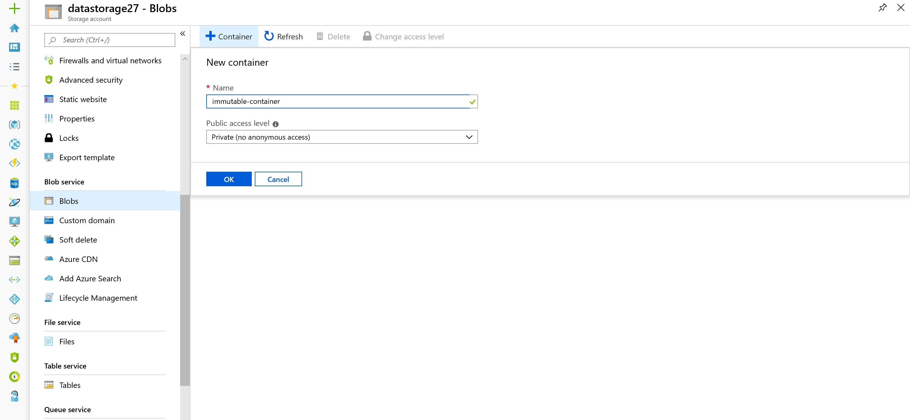

Click on the new container:

- Under Settings, Select Access Policy 

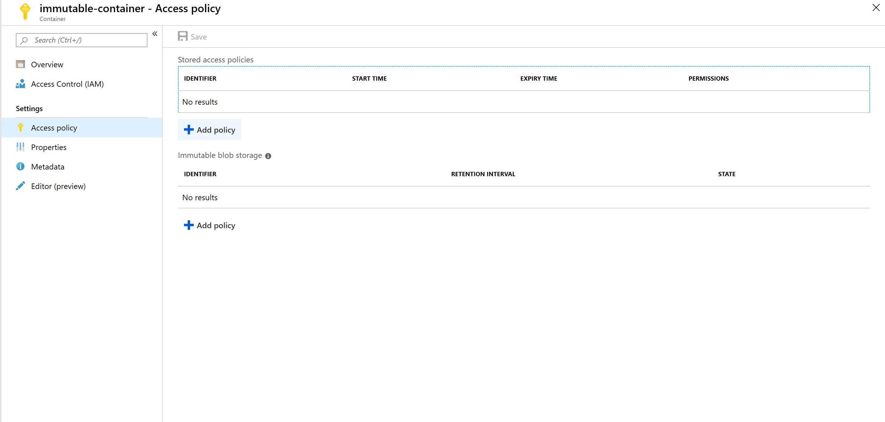

- Under Immutable blob storage, Select + Add Policy

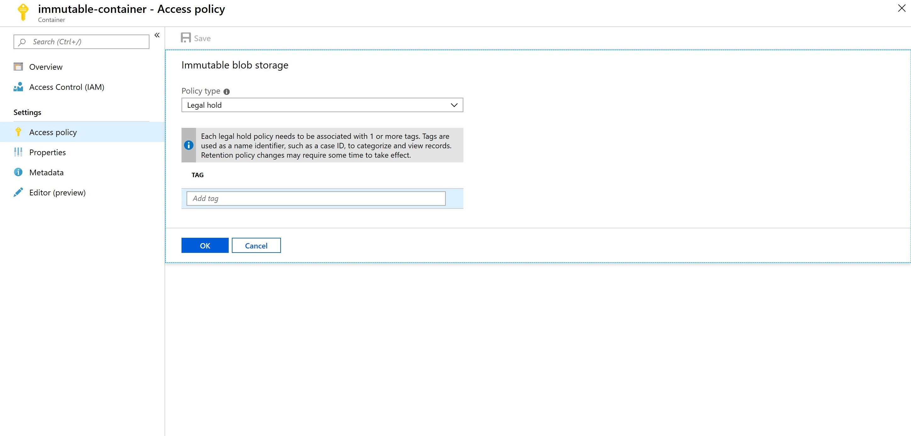
- Add a tag and select OK 

#### Create Event Hubs 

- Click the + symbol in the upper left corner of the screen to add a new resource
- Search for and select Event Hubs and then click Create
- Navigate to recently created Event Hubs Namespace
- Create New Event Hub

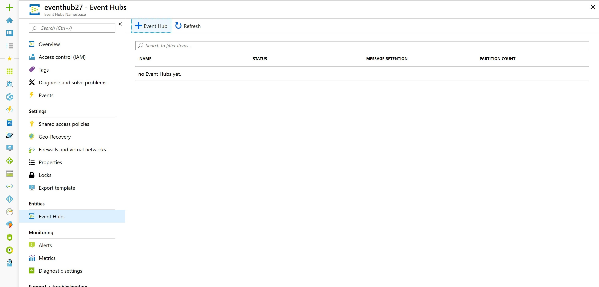

- Fill in the following:
    - Name
    - Partition Count
    - Turn On Capture
    - Specify the time window, which is the interval in which Event Hubs will write the events to a blob
    - Size Window
    - Enable Do Not emit empty files ... 

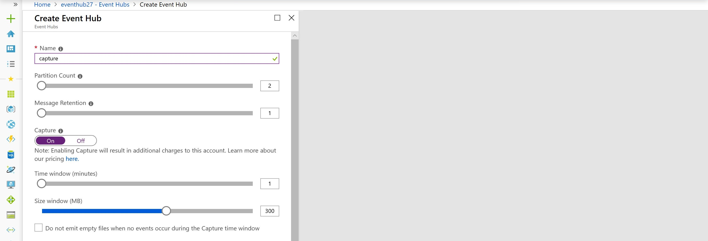

- Select Capture Provider as Azure Storage
- Select your immutable container
- Customize the format for your catured file name
- Select Create

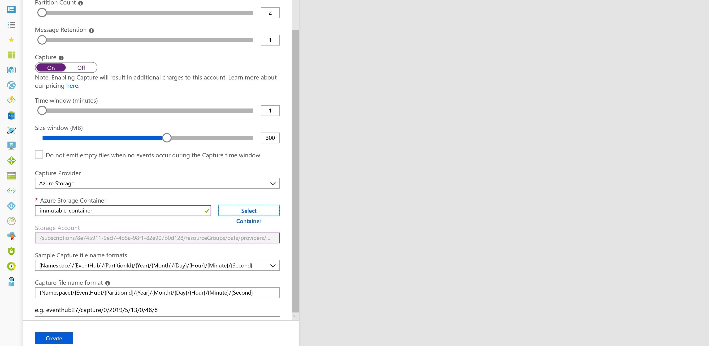


#### Create Azure Function to Hash File Content

- Click the + symbol in the upper left corner of the screen to add a new resource
- Search for and select Function App and then click Create
- Fill out the details accordingly:
    - Storage: create new one for the Hash Function 

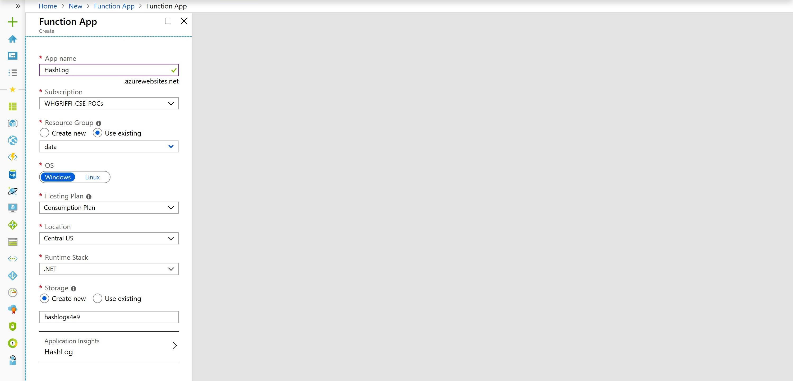

- Create new function
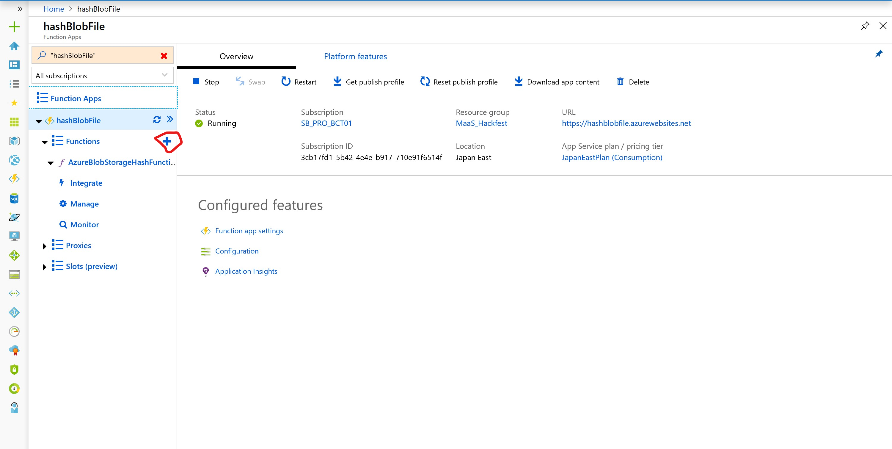

- Select HTTP trigger template
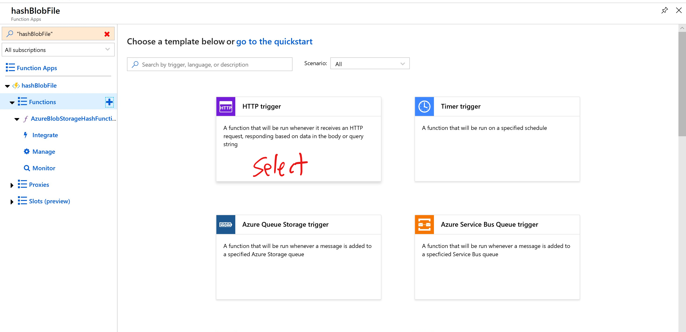
- Name function and Create

- In the function editor, Replace the Default Code with:

```c#
#r "Newtonsoft.Json"

using System.Net;
using Microsoft.AspNetCore.Mvc;
using Microsoft.Extensions.Primitives;
using Newtonsoft.Json;
using System.Security.Cryptography;
using System.Text;

public static async Task<IActionResult> Run(HttpRequest req, ILogger log)
{
    log.LogInformation("C# HTTP trigger function processed a request.");

    string requestBody = await new StreamReader(req.Body).ReadToEndAsync();

    if (string.IsNullOrWhiteSpace(requestBody))
        return new BadRequestObjectResult("File content or metadata failed to be hashed.");

    string contentHash = ComputeSha256Hash(requestBody);
        
    return (ActionResult)new OkObjectResult(contentHash);
}

public static string ComputeSha256Hash(string rawData)  
{  
    // Create a SHA256   
    using (SHA256 sha256Hash = SHA256.Create())  
    {  
        // ComputeHash - returns byte array  
        byte[] bytes = sha256Hash.ComputeHash(Encoding.UTF8.GetBytes(rawData));  

        // Convert byte array to a string   
        StringBuilder builder = new StringBuilder();  
        for (int i = 0; i < bytes.Length; i++)  
        {  
            builder.Append(bytes[i].ToString("x2"));  
        }  
        return builder.ToString();  
    }  
} 
```

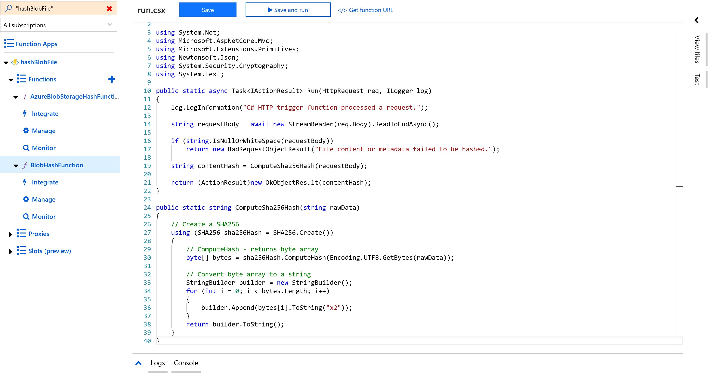

- Save 

#### Create Logic App 

- Click the + symbol in the upper left corner of the screen to add a new resource
- Search for and select Logic App and then click Create
- Navigate to recently created Logic App 
- In the Logic App Designer, select Blank Template

##### Event Grid Connector

If you haven't previously used Event Grid in your Azure subscription, you may need to register the Event Grid resource provider.

In the Azure portal:
- Select Subscriptions.
- Select the subscription you're using for Event Grid.
- Under Settings, select Resource providers.
- Find Microsoft.EventGrid.
- If not registered, select Register.

It may take a moment for the registration to finish. Select Refresh to update the status. When Status is Registered, you're ready to continue.


In the Logic App Designer
- Search for Event Grid Connect
- Select Trigger When A Resource event occurs
- And fill out the following accordingly:
    - Resource Type: Microsoft.Storage.StorageAccounts
    - Resource Name: Name of Storage Acct with Immutable Blob
    - Event Type: Microsoft.Storage.BlobCreated

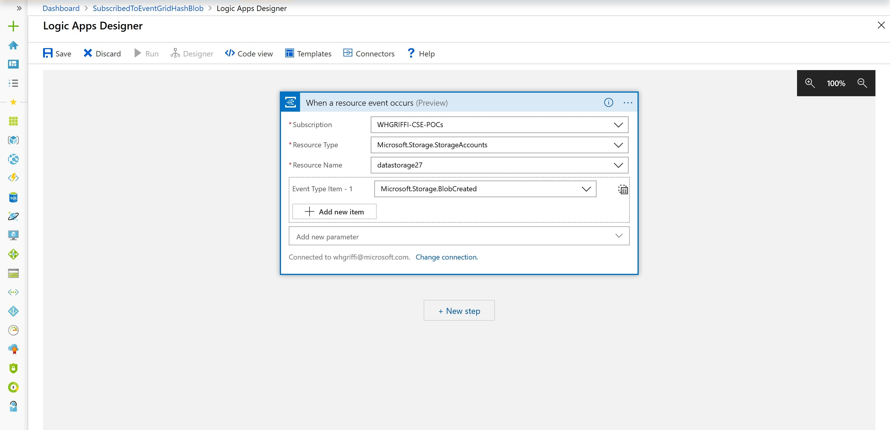


#### Retrieve Blob Content Connector 

In the Logic App Designer:

- Add New Step
- Search for Azure Blob Storage
- Select Action: Get Blob Content Using Path

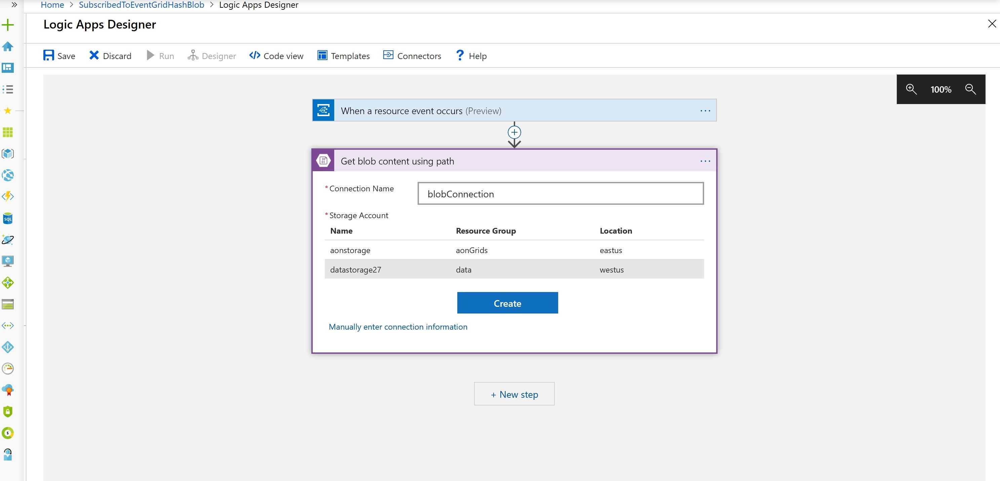

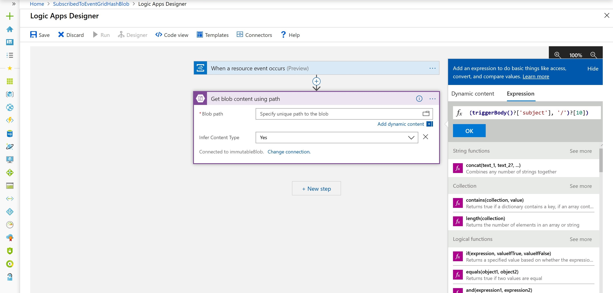

- Blob Path: 
    - Select Add Dynamic content
    - Select Expression Tab
    - If the default Capture Folder Path was left:
        - Paste the following: ```concat(split(triggerBody()?['subject'], '/')?[4], '/', split(triggerBody()?['subject'], '/')?[6], '/', split(triggerBody()?['subject'], '/')?[7], '/', split(triggerBody()?['subject'], '/')?[8], '/', split(triggerBody()?['subject'], '/')?[9], '/', split(triggerBody()?['subject'], '/')?[10], '/', split(triggerBody()?['subject'], '/')?[11], '/', split(triggerBody()?['subject'], '/')?[12], '/', split(triggerBody()?['subject'], '/')?[13], '/', split(triggerBody()?['subject'], '/')?[14])```
        - Else, customize accordingly
    - Select OK


#### Hash Log Function Connector 

In the Logic App Designer:

- Add New Step
- Search for and Select Azure Functions
- Select the Function App you created previously
- Select the Hash Log Function

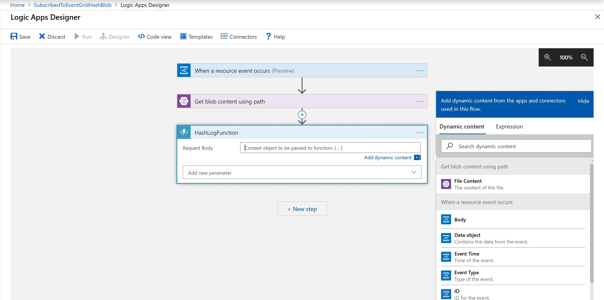
- Request Body: Select the Dynamic Content, File Content


#### Smart Contract Connector 

In the Logic App Designer:

- Add New Step
- Search for and Select Ethereum Blockchain
- Select Action: Execute Smart Contract 
- Fill out your connection information
    - Specify Private Key 

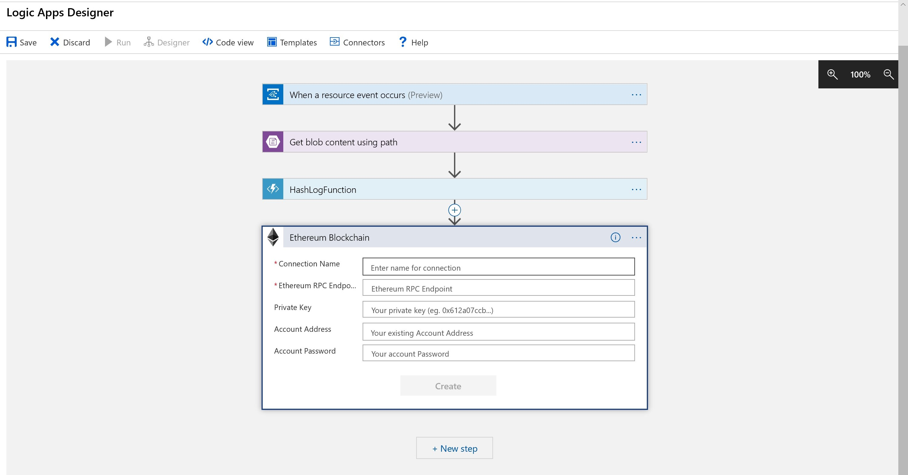

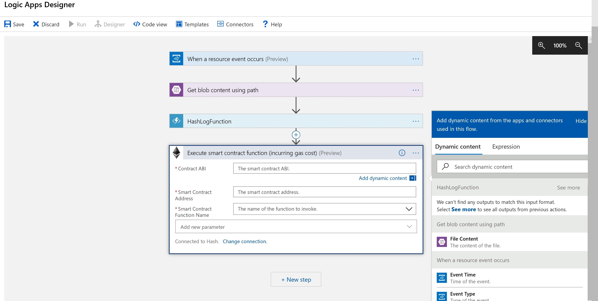

Fill in the following:
- Smart Contract ABI for HashLog Contract [Refer to Prerequisites](###Prerequisites):

```json
[
    {
      "anonymous": false,
      "inputs": [
        {
          "indexed": false,
          "name": "filename",
          "type": "string"
        },
        {
          "indexed": false,
          "name": "hashvalue",
          "type": "string"
        }
      ],
      "name": "inserted",
      "type": "event"
    },
    {
      "constant": false,
      "inputs": [
        {
          "name": "filename",
          "type": "string"
        },
        {
          "name": "hashvalue",
          "type": "string"
        }
      ],
      "name": "insert",
      "outputs": [
        {
          "name": "sufficient",
          "type": "bool"
        }
      ],
      "payable": false,
      "stateMutability": "nonpayable",
      "type": "function"
    },
    {
      "constant": true,
      "inputs": [
        {
          "name": "filename",
          "type": "string"
        }
      ],
      "name": "getLog",
      "outputs": [
        {
          "name": "",
          "type": "string"
        }
      ],
      "payable": false,
      "stateMutability": "view",
      "type": "function"
    }
  ]
  ```

- filename
    - If you used the default capture folder path, then paste:
```split(triggerBody()?['subject'], '/')?[14]```
- hashValue
    - This will be the body of the HashLog Function
- Add New Parameter
    - Gas Limit: Set as 30000

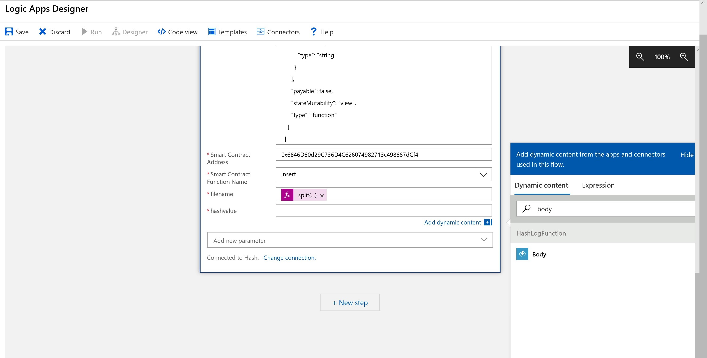

#### Run Logic App

Save the Logic App and Run

Trigger the Logic App by sending events to Event Hub.

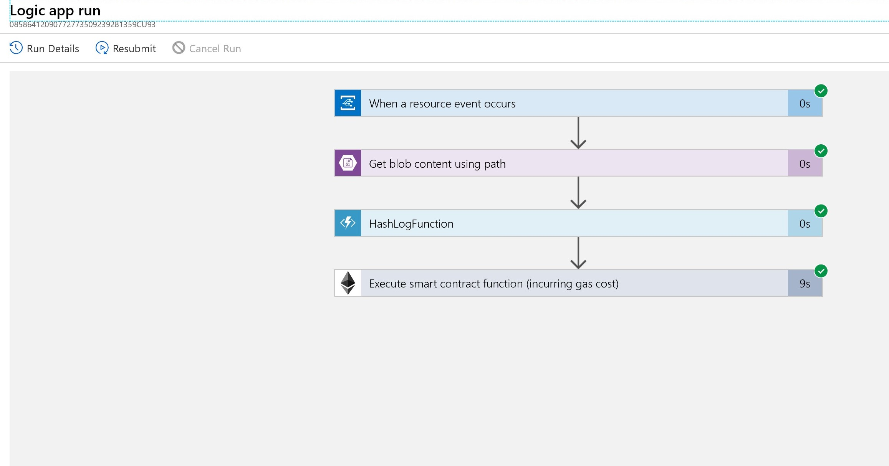
